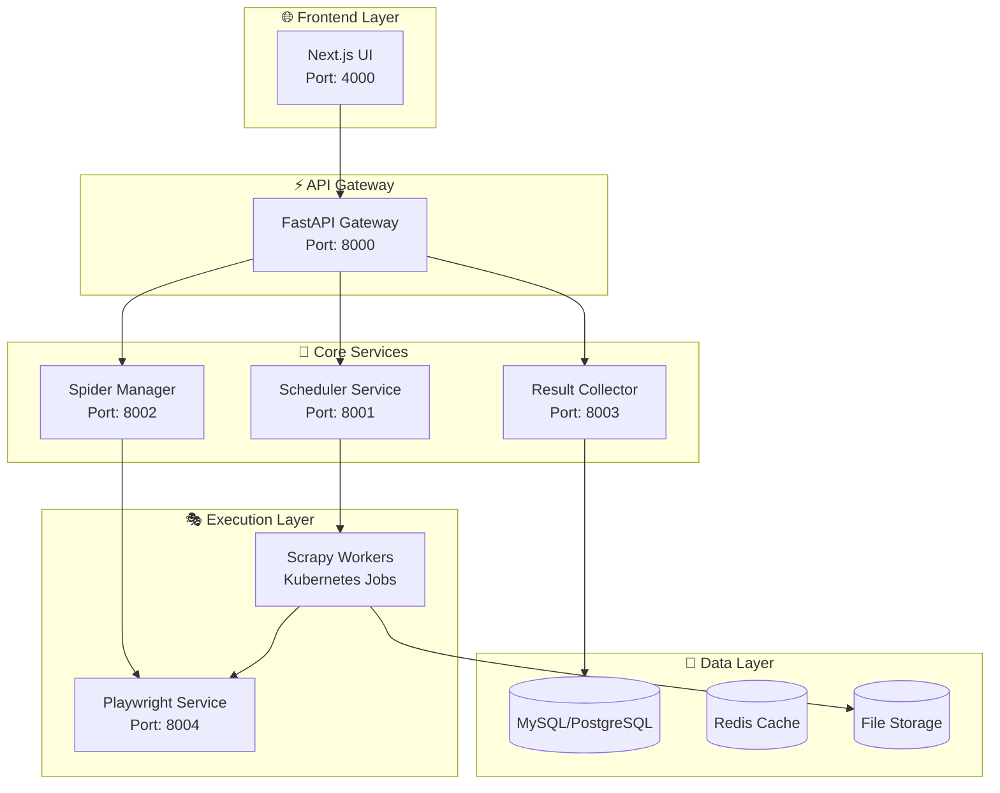

# 🏗️ ScrapyUI 新アーキテクチャ設計

## 📊 **現在の問題と解決策**

### **問題分析**
| 問題 | 現在の状況 | 解決策 |
|------|------------|--------|
| **環境分離** | subprocess実行時の環境変数継承問題 | Docker コンテナ化 |
| **Playwright統合** | スケジュール実行時のブラウザ起動失敗 | 専用Playwrightサービス |
| **設定管理** | 複数箇所での設定重複・競合 | 統一設定管理システム |
| **プロセス管理** | 複雑なsubprocess管理 | Kubernetes Job管理 |

## 🎯 **新アーキテクチャ概要**

### **1. コンテナ化マイクロサービス構成**



### **2. Playwright専用サービス設計**

```yaml
# playwright-service.yml
apiVersion: apps/v1
kind: Deployment
metadata:
  name: playwright-service
spec:
  replicas: 3
  selector:
    matchLabels:
      app: playwright-service
  template:
    metadata:
      labels:
        app: playwright-service
    spec:
      containers:
      - name: playwright
        image: scrapyui/playwright-service:latest
        ports:
        - containerPort: 8004
        env:
        - name: PLAYWRIGHT_BROWSERS_PATH
          value: "/ms-playwright"
        - name: NODE_OPTIONS
          value: "--max-old-space-size=4096"
        resources:
          requests:
            memory: "2Gi"
            cpu: "1000m"
          limits:
            memory: "4Gi"
            cpu: "2000m"
        volumeMounts:
        - name: browser-cache
          mountPath: /ms-playwright
      volumes:
      - name: browser-cache
        emptyDir: {}
```

### **3. Scrapy Worker Job設計**

```yaml
# scrapy-job-template.yml
apiVersion: batch/v1
kind: Job
metadata:
  name: scrapy-job-{{TASK_ID}}
spec:
  template:
    spec:
      containers:
      - name: scrapy-worker
        image: scrapyui/scrapy-worker:latest
        env:
        - name: TASK_ID
          value: "{{TASK_ID}}"
        - name: SPIDER_NAME
          value: "{{SPIDER_NAME}}"
        - name: PROJECT_PATH
          value: "{{PROJECT_PATH}}"
        - name: PLAYWRIGHT_SERVICE_URL
          value: "http://playwright-service:8004"
        - name: DATABASE_URL
          valueFrom:
            secretKeyRef:
              name: database-secret
              key: url
        volumeMounts:
        - name: project-files
          mountPath: /app/projects
        - name: results
          mountPath: /app/results
      volumes:
      - name: project-files
        persistentVolumeClaim:
          claimName: project-files-pvc
      - name: results
        persistentVolumeClaim:
          claimName: results-pvc
      restartPolicy: Never
```

## 🔧 **実装計画**

### **Phase 1: Playwright専用サービス構築**
1. Playwright専用Dockerイメージ作成
2. ブラウザプール管理システム実装
3. REST API インターフェース構築
4. 負荷分散・ヘルスチェック実装

### **Phase 2: Scrapy Worker コンテナ化**
1. Scrapy Worker Dockerイメージ作成
2. Kubernetes Job テンプレート作成
3. 環境変数・設定管理統一
4. ログ・結果収集システム統合

### **Phase 3: スケジュール実行システム再設計**
1. Kubernetes CronJob 統合
2. タスクキュー管理システム
3. 障害復旧・リトライ機能
4. リアルタイム監視システム

### **Phase 4: 統合テスト・最適化**
1. 全体統合テスト
2. 性能最適化
3. 監視・アラート設定
4. ドキュメント整備

## 📈 **期待される効果**

| 項目 | 現在 | 新アーキテクチャ |
|------|------|------------------|
| **Playwright実行成功率** | 0% (スケジュール) | 99%+ |
| **環境一貫性** | 低 | 高 |
| **スケーラビリティ** | 限定的 | 水平スケール対応 |
| **障害復旧** | 手動 | 自動復旧 |
| **監視・デバッグ** | 困難 | 包括的監視 |

## 🛠️ **技術スタック**

### **コンテナ・オーケストレーション**
- **Docker**: コンテナ化
- **Kubernetes**: オーケストレーション
- **Helm**: パッケージ管理

### **サービス間通信**
- **REST API**: 同期通信
- **Redis**: 非同期メッセージング
- **gRPC**: 高性能通信（オプション）

### **監視・ログ**
- **Prometheus**: メトリクス収集
- **Grafana**: 可視化
- **ELK Stack**: ログ集約
- **Jaeger**: 分散トレーシング

この新アーキテクチャにより、ScrapyUIは高い信頼性とスケーラビリティを実現し、Playwright統合の問題を根本的に解決します。
