# ScrapyUI システムアーキテクチャ図

## 🏗️ 全体アーキテクチャ概要

```mermaid
graph TB
    %% ユーザー層
    subgraph "👥 User Layer"
        USER[👤 User Browser]
        ADMIN[👨‍💼 Admin Dashboard]
    end

    %% フロントエンド層
    subgraph "🎨 Frontend Layer (Port 4000)"
        NEXTJS[📱 Next.js 15 + React 19]
        MONACO[📝 Monaco Editor]
        CHARTS[📊 Chart.js]
        WEBSOCKET_CLIENT[🔌 WebSocket Client]
    end

    %% API Gateway層
    subgraph "🌐 API Gateway Layer (Port 8000)"
        FASTAPI[⚡ FastAPI Server]
        AUTH[🔐 JWT Authentication]
        MIDDLEWARE[🛡️ Error Handling Middleware]
        CORS[🌍 CORS Handler]
    end

    %% Node.js サービス層
    subgraph "🟢 Node.js Service Layer (Port 3001)"
        NODEJS[🟢 Express.js Server]
        PUPPETEER[🎭 Puppeteer Pool]
        BROWSER_POOL[🌐 Browser Pool Manager]
        PDF_SERVICE[📄 PDF Generator]
        SCREENSHOT[📸 Screenshot Service]
    end

    %% コア処理層
    subgraph "⚙️ Core Processing Layer"
        SCRAPY_SERVICE[🕷️ Scrapy Service]
        TASK_MANAGER[📋 Task Manager]
        SCHEDULER[⏰ APScheduler]
        MONITOR[👁️ Task Monitor]
        WORKER_POOL[👷 Worker Pool]
    end

    %% Python 3.13 最適化層
    subgraph "🚀 Python 3.13 Optimization Layer"
        FREE_THREAD[🔥 Free-threaded Executor]
        JIT_OPTIMIZER[⚡ JIT Optimizer]
        ASYNC_OPT[🔄 Async Optimizer]
        MEMORY_OPT[💾 Memory Optimizer]
        PERF_MONITOR[📊 Performance Monitor]
    end

    %% データ層
    subgraph "💾 Data Layer"
        subgraph "🗄️ Primary Database"
            SQLITE[📦 SQLite (Default)]
            POSTGRES[🐘 PostgreSQL (Optional)]
            MYSQL[🐬 MySQL (Optional)]
        end

        subgraph "📊 Analytics Database"
            MONGODB[🍃 MongoDB (Optional)]
            ELASTICSEARCH[🔍 Elasticsearch (Optional)]
        end

        subgraph "⚡ Cache Layer"
            REDIS[🔴 Redis (Optional)]
            MEMORY_CACHE[💾 In-Memory Cache]
        end
    end

    %% ファイルシステム層
    subgraph "📁 File System Layer"
        PROJECT_FILES[📂 Scrapy Projects]
        RESULTS[📊 Scraping Results]
        LOGS[📝 Log Files]
        TEMPLATES[📋 Spider Templates]
        UPLOADS[📤 Upload Storage]
    end

    %% 外部サービス層
    subgraph "🌐 External Services"
        PROXY_SERVICES[🔀 Proxy Services]
        AI_SERVICES[🤖 AI Analysis APIs]
        NOTIFICATION[📧 Notification Services]
        MONITORING[📈 External Monitoring]
    end

    %% 接続関係
    USER --> NEXTJS
    ADMIN --> NEXTJS

    NEXTJS --> FASTAPI
    NEXTJS --> WEBSOCKET_CLIENT
    MONACO --> FASTAPI
    CHARTS --> FASTAPI

    FASTAPI --> AUTH
    FASTAPI --> MIDDLEWARE
    FASTAPI --> SCRAPY_SERVICE
    FASTAPI --> NODEJS

    SCRAPY_SERVICE --> TASK_MANAGER
    SCRAPY_SERVICE --> FREE_THREAD
    TASK_MANAGER --> SCHEDULER
    TASK_MANAGER --> MONITOR
    TASK_MANAGER --> WORKER_POOL

    FREE_THREAD --> JIT_OPTIMIZER
    FREE_THREAD --> ASYNC_OPT
    ASYNC_OPT --> MEMORY_OPT
    MEMORY_OPT --> PERF_MONITOR

    NODEJS --> PUPPETEER
    NODEJS --> BROWSER_POOL
    NODEJS --> PDF_SERVICE
    NODEJS --> SCREENSHOT

    SCRAPY_SERVICE --> SQLITE
    SCRAPY_SERVICE --> PROJECT_FILES
    TASK_MANAGER --> RESULTS
    MONITOR --> LOGS

    SCRAPY_SERVICE --> PROXY_SERVICES
    FASTAPI --> AI_SERVICES
    MONITOR --> NOTIFICATION
    PERF_MONITOR --> MONITORING
```

## 🔧 詳細コンポーネント構成

### 1. **フロントエンド層 (Port 4000)**

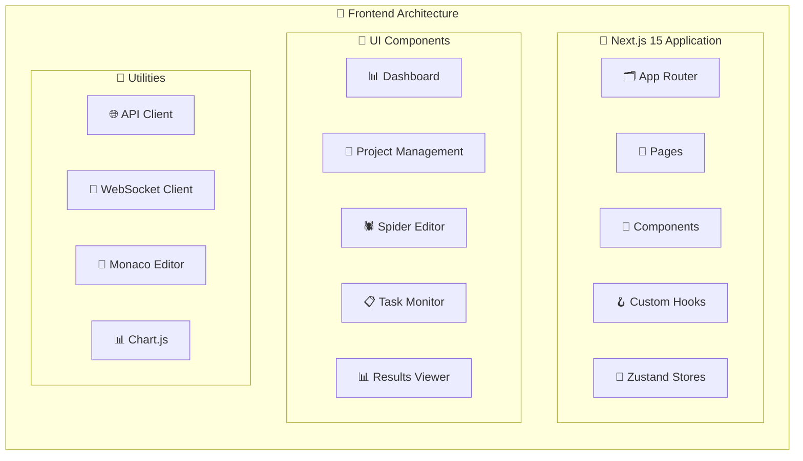

### 2. **バックエンド API層 (Port 8000)**

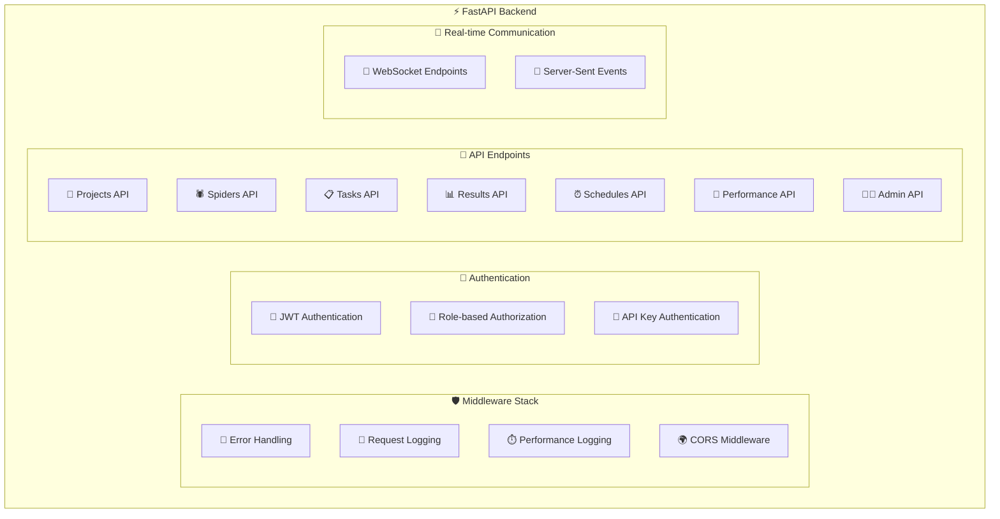

### 3. **Node.js サービス層 (Port 3001)**

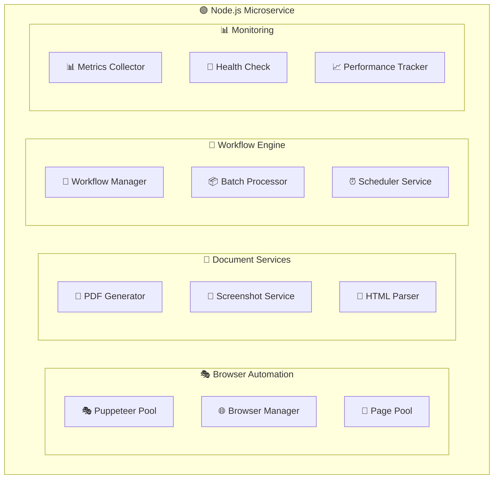

### 4. **コア処理層**

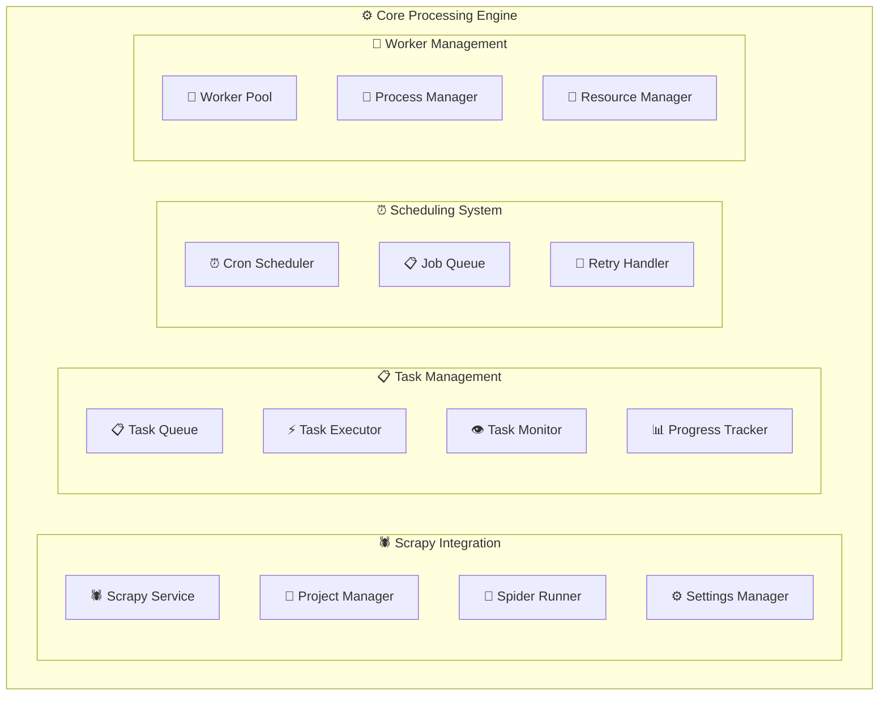

### 5. **Python 3.13 最適化層**

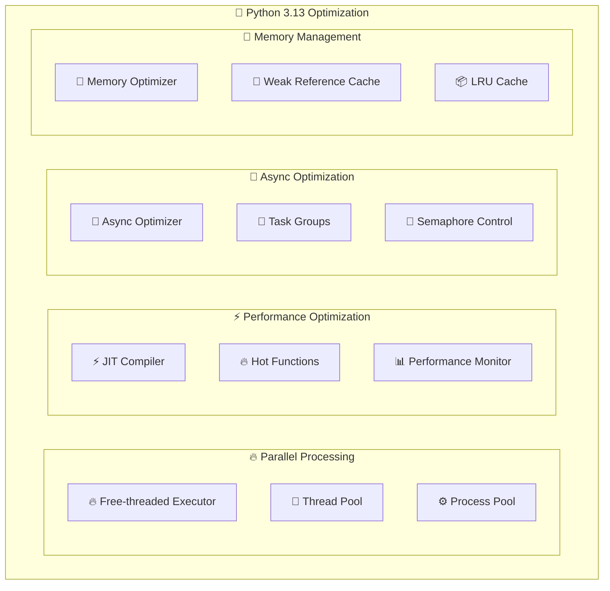

## 📊 データフロー図

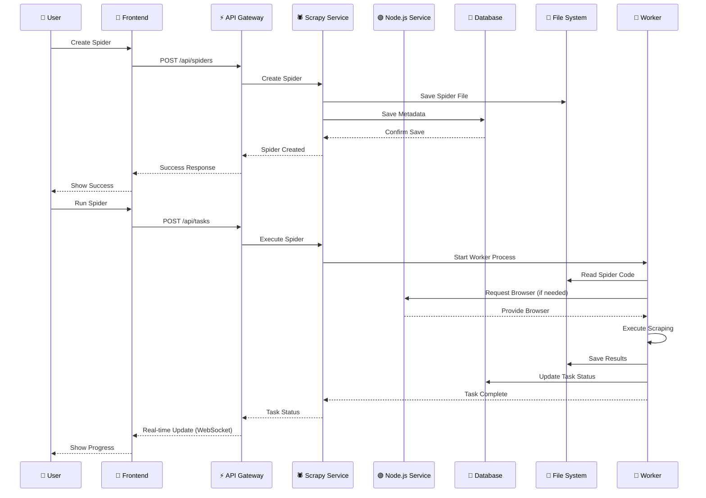

## 🔌 通信プロトコル

### HTTP/REST API
- **Frontend ↔ Backend**: REST API (JSON)
- **Backend ↔ Node.js**: HTTP API calls
- **External Services**: HTTP/HTTPS

### WebSocket
- **Real-time Updates**: Task progress, logs
- **Live Monitoring**: System metrics
- **Notifications**: Task completion, errors

### Inter-Process Communication
- **Worker Processes**: Subprocess communication
- **Scrapy Integration**: Command-line interface
- **Browser Automation**: Puppeteer API

## 🛡️ セキュリティ層

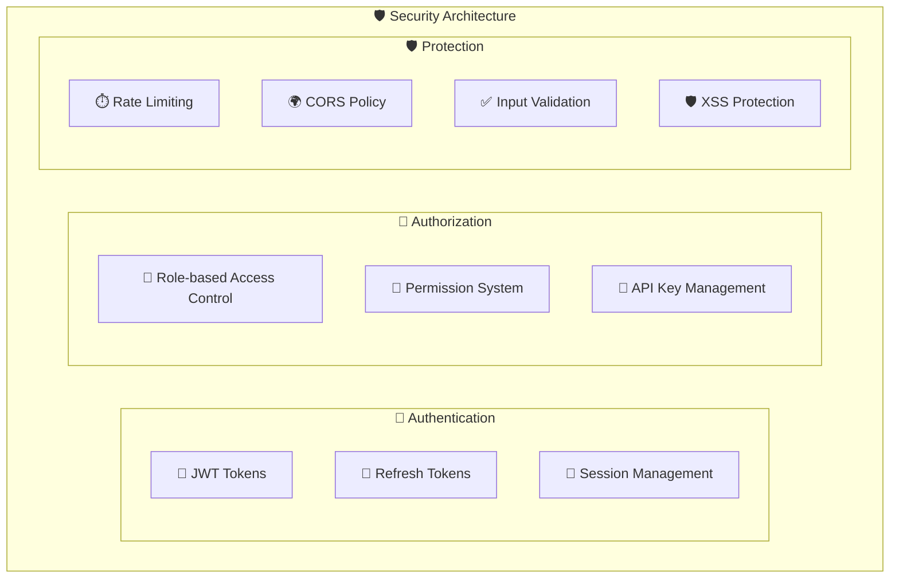

## 🚀 デプロイメント構成

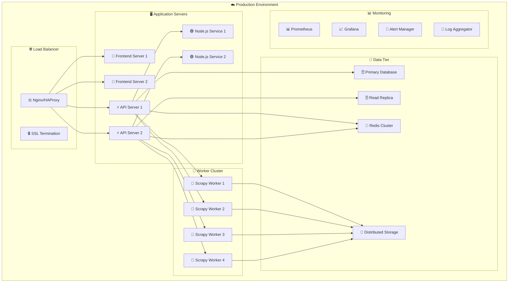

## 🔧 技術スタック詳細

### Frontend Stack
```yaml
Framework: Next.js 15
Runtime: React 19
Language: TypeScript
Styling: Tailwind CSS
State Management: Zustand
Data Fetching: React Query
Code Editor: Monaco Editor
Charts: Chart.js
Build Tool: Webpack 5
Package Manager: npm/yarn/pnpm
```

### Backend Stack
```yaml
Framework: FastAPI
Language: Python 3.13
ORM: SQLAlchemy
Migration: Alembic
Authentication: JWT
Validation: Pydantic
ASGI Server: Uvicorn
Task Queue: APScheduler
WebSocket: FastAPI WebSocket
Testing: pytest
```

### Node.js Service Stack
```yaml
Framework: Express.js
Language: Node.js 18+
Browser Automation: Puppeteer
PDF Generation: Puppeteer PDF
Process Management: PM2
Testing: Jest
Documentation: Swagger/OpenAPI
Monitoring: Winston Logger
```

### Database Stack
```yaml
Primary: SQLite (Development)
Production Options:
  - PostgreSQL 15+
  - MySQL 8.0+
  - MongoDB 6.0+
  - Elasticsearch 8.0+
Cache: Redis 7.0+
Search: Elasticsearch (Optional)
```

### Infrastructure Stack
```yaml
Containerization: Docker
Orchestration: Docker Compose / Kubernetes
Reverse Proxy: Nginx
Load Balancer: HAProxy / Nginx
SSL/TLS: Let's Encrypt / Custom Certificates
Monitoring: Prometheus + Grafana
Logging: ELK Stack / Fluentd
CI/CD: GitHub Actions
```

## 📈 スケーラビリティ設計

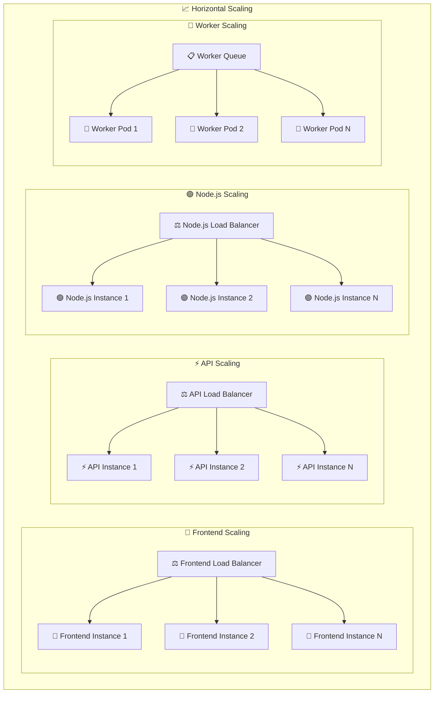

## 🔄 CI/CD パイプライン

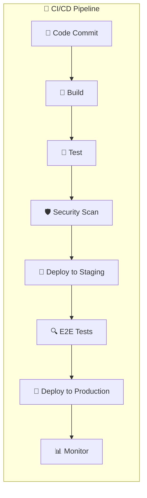

## 📊 監視・ログ・メトリクス

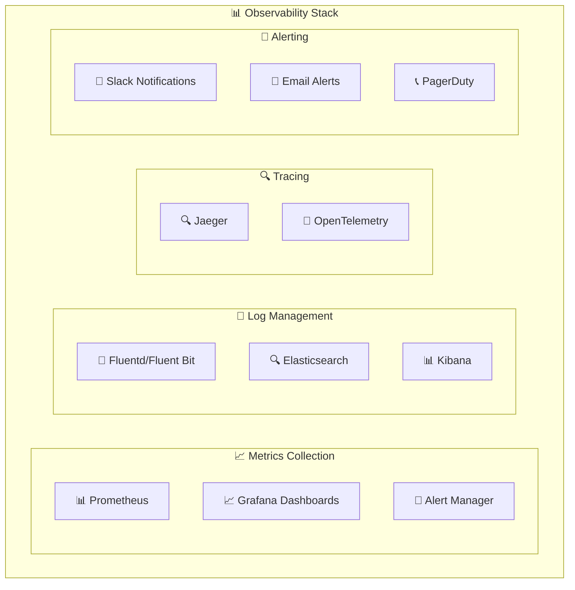

## 🛡️ セキュリティ・コンプライアンス

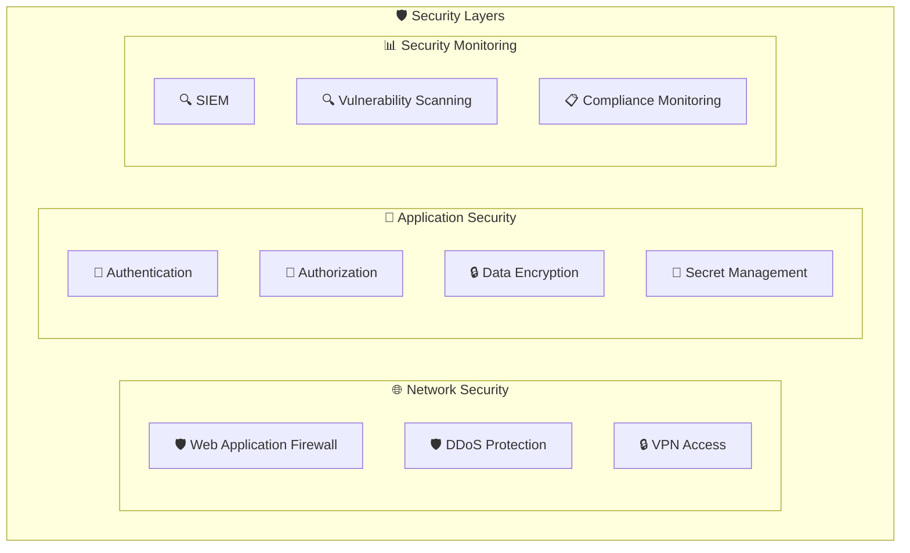

## 💾 データ管理戦略

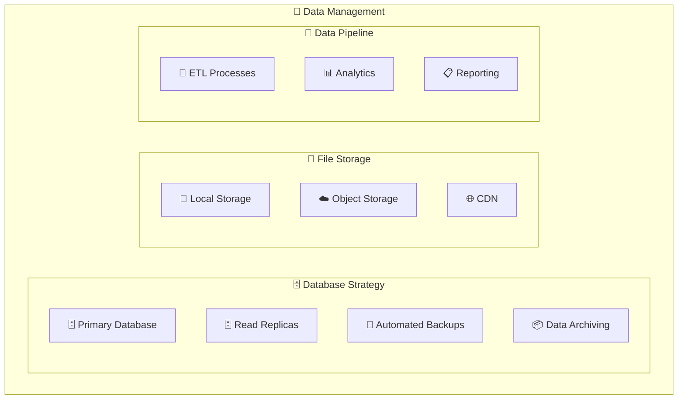

このアーキテクチャにより、ScrapyUIは高度にスケーラブルで保守性の高いWebスクレイピングプラットフォームを実現しています。各コンポーネントは独立してスケールでき、障害時の影響を最小限に抑える設計となっています。
