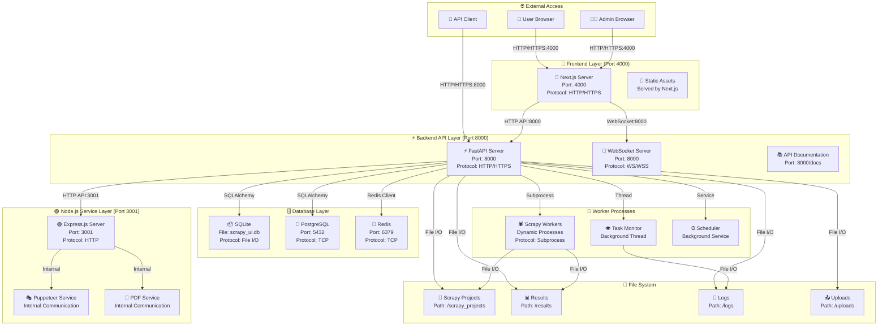
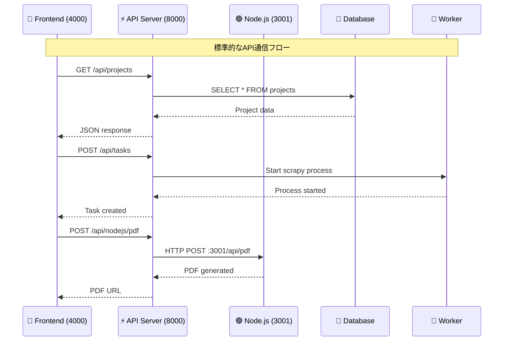
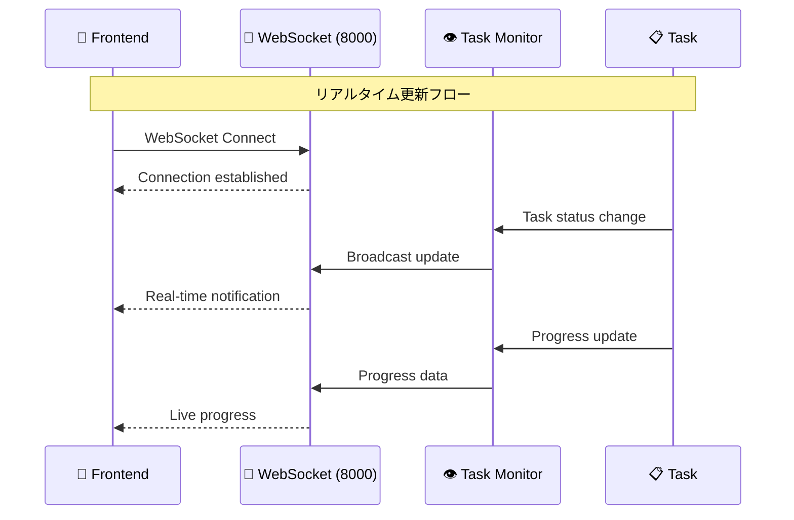
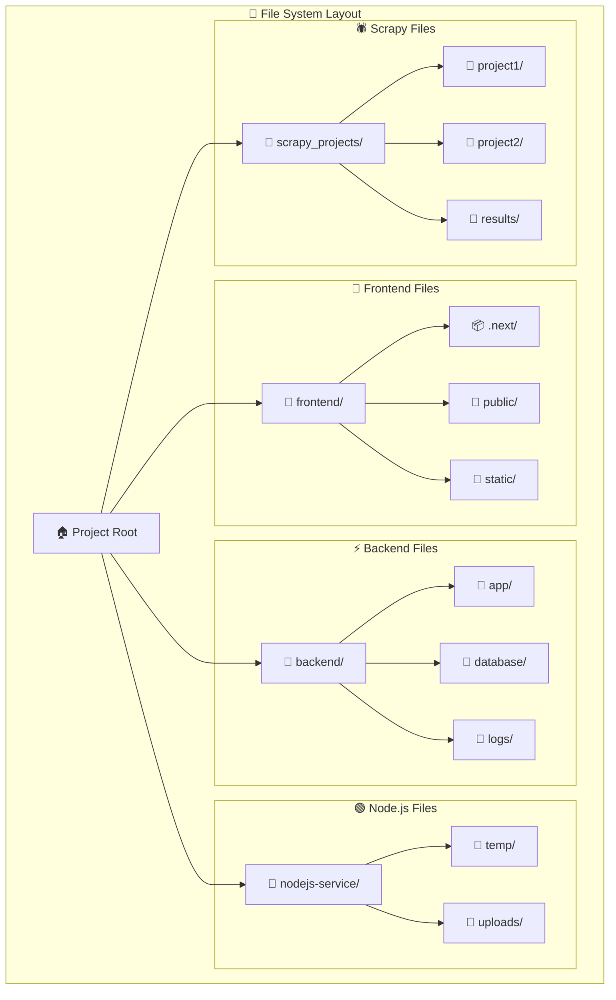
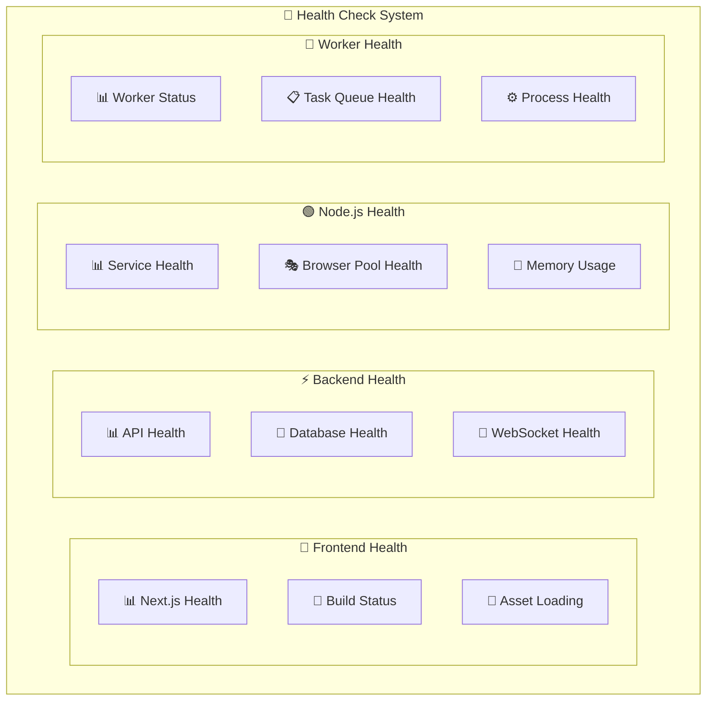

# ScrapyUI サービス間通信・ポート構成図

## 🔌 ポート構成とサービス通信



## 📡 通信プロトコル詳細

### HTTP/REST API 通信



### WebSocket リアルタイム通信



## 🔧 サービス設定詳細

### Frontend Service (Port 4000)
```yaml
Service: Next.js Development Server
Port: 4000
Protocol: HTTP (dev) / HTTPS (prod)
Environment Variables:
  - NEXT_PUBLIC_API_URL=http://localhost:8000
  - NEXT_PUBLIC_WS_URL=ws://localhost:8000
Proxy Configuration:
  - /api/* → http://localhost:8000/api/*
Static Assets: Served by Next.js
Hot Reload: Enabled in development
```

### Backend API Service (Port 8000)
```yaml
Service: FastAPI + Uvicorn
Port: 8000
Protocol: HTTP/HTTPS + WebSocket
Workers: 1 (dev) / 4+ (prod)
Environment Variables:
  - DATABASE_URL=sqlite:///./database/scrapy_ui.db
  - NODEJS_SERVICE_URL=http://localhost:3001
  - JWT_SECRET_KEY=your-secret-key
Endpoints:
  - REST API: /api/*
  - WebSocket: /ws/*
  - Documentation: /docs
  - Health Check: /health
```

### Node.js Service (Port 3001)
```yaml
Service: Express.js + Puppeteer
Port: 3001
Protocol: HTTP
Process Manager: PM2 (prod)
Environment Variables:
  - PORT=3001
  - PUPPETEER_EXECUTABLE_PATH=/usr/bin/chromium
  - MAX_BROWSER_INSTANCES=5
Services:
  - PDF Generation: /api/pdf
  - Screenshot: /api/screenshot
  - Web Scraping: /api/scraping
  - Health Check: /api/health
```

## 🗄️ データベース接続

### SQLite (Development)
```yaml
Type: File-based Database
Location: backend/database/scrapy_ui.db
Connection: SQLAlchemy File URI
Backup: File copy
Migration: Alembic
```

### PostgreSQL (Production)
```yaml
Type: Network Database
Port: 5432
Connection Pool: 20 connections
SSL: Required in production
Backup: pg_dump automated
Migration: Alembic
```

### Redis (Cache/Queue)
```yaml
Type: In-memory Database
Port: 6379
Use Cases:
  - Session storage
  - Task queue
  - Cache layer
  - Real-time data
```

## 📁 ファイルシステム構成



## 🔄 プロセス管理

### Development Environment
```yaml
Frontend: npm run dev (Port 4000)
Backend: uvicorn main:app --reload (Port 8000)
Node.js: npm run dev (Port 3001)
Database: SQLite file
Monitoring: Console logs
```

### Production Environment
```yaml
Frontend: 
  - Build: npm run build
  - Serve: npm start or static hosting
Backend:
  - Server: uvicorn main:app --workers 4
  - Process Manager: systemd or Docker
Node.js:
  - Process Manager: PM2
  - Clustering: PM2 cluster mode
Database:
  - PostgreSQL with connection pooling
  - Redis for caching
Monitoring:
  - Prometheus metrics
  - Grafana dashboards
  - Log aggregation
```

## 🚨 ヘルスチェック・監視



### Health Check Endpoints
```yaml
Frontend: http://localhost:4000/_next/static/health
Backend: http://localhost:8000/health
Node.js: http://localhost:3001/api/health
Database: Connection test in API health check
Workers: Process status in API health check
```

このサービス間通信図により、ScrapyUIの各コンポーネントがどのように連携し、どのポートで通信しているかが明確になります。
